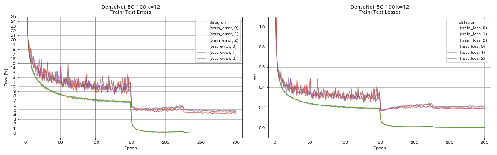

# PyTorch Implementation of DenseNet

## Usage

```
$ python main.py --block_type bottleneck --depth 100 --growth_rate 12 --compression_rate 0.5 --drop_rate 0 --outdir results
```

## Results on CIFAR-10

| Model                  | Test Error (median of 3 runs) | Test Error (in paper) | Training Time |
|:-----------------------|:-----------------------------:|:---------------------:|--------------:|
| DenseNet-100 (k=12)    |                               | 4.10 (1 run)          |               |
| DenseNet-100 (k=24)    |                               | 3.74 (1 run)          |               |
| DenseNet-BC-100 (k=12) | 4.69                          | 4.51 (1 run)          |  15h20m       |
| DenseNet-BC-250 (k=24) |                               | 3.62 (1 run)          |               |
| DenseNet-BC-190 (k=40) |                               | 3.46 (1 run)          |               |



**NOTE** This model was trained with batch size 32 and initial learning rate 0.05. In the paper, they use batch size 64 and initial learning rate 0.1.

## References

* Huang, Gao, et al. "Densely connected convolutional networks." The IEEE Conference on Computer Vision and Pattern Recognition (CVPR), 2017, pp. 4700-4708. [arXiv:1608.06993]( https://arxiv.org/abs/1608.06993 ), [Torch implementation]( https://github.com/liuzhuang13/DenseNet )


